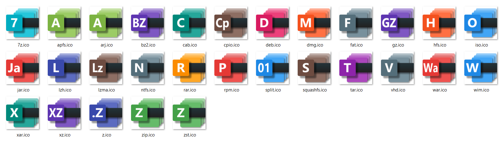
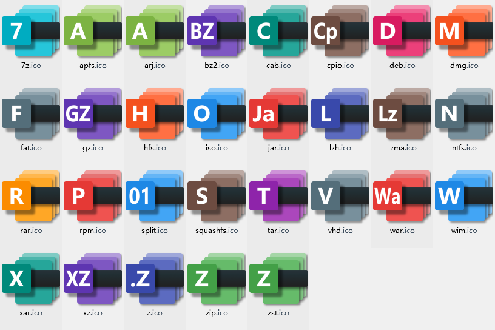

# 7-Zip Automatic Compilation Script

🌍 **[简体中文](README.md) | [English](README-EN.md)**

An automatic compilation script for [7-Zip](https://www.7-zip.org/), which replaces the default file association icons and file manager skins with more attractive ones, and adds associations for Jar and War files.

The file association icons and file manager skins currently used were downloaded online for personal use. If the original authors see this repository, please contact me to add author information.

## File Manager Preview

## File Association Icons Preview

## Usage

> - To execute `.ps1` scripts with PowerShell requires appropriate permissions, which are not covered here.
> - Compilation requires **Visual Studio** with the **Desktop development with C++** workload installed.
> - The following process uses version `7z2408` as an example.

1. Download the source code and replace resource files.

    1. Open PowerShell.
    2. Execute `.\Prepare.ps1 7z2408`.

2. Compile the x64 version of the software.

    1. Open the x64 Developer Command Prompt for Visual Studio, e.g., **x64 Native Tools Command Prompt for VS 2022**.
    2. Switch to PowerShell. If PowerShell Core is installed, enter `pwsh`; otherwise, enter `powershell`.
    3. Execute `.\Build.ps1 7z2408`.

3. Compile the x86 Shell extension.

    1. Open the x86 Developer Command Prompt for Visual Studio, e.g., **x64_x86 Cross Tools Command Prompt for VS 2022**.
    2. Switch to PowerShell. If PowerShell Core is installed, enter `pwsh`; otherwise, enter `powershell`.
    3. Execute `.\BuildShell32.ps1 7z2408`.

4. Package 7-Zip and create the installer.

    1. Open PowerShell.
    2. Execute `.\Pack.ps1 7z2408`.
    3. Check if the generated installer **7z2408.exe** is functional.

## License

- This project is licensed under the MIT license. See the [LICENSE](LICENSE.md) file for details.
- The 7-Zip project is licensed under the GNU LGPL, BSD 3, and unRAR licenses. See the [LICENSE](https://www.7-zip.org/license.txt) file for details.

## About Us

- Release: [52PoJie &lt;https://www.52pojie.cn/thread-1955841-1-1.html&gt;](https://www.52pojie.cn/thread-1955841-1-1.html)
- Website: [RainCandy Tech &lt;https://raincandy.tech&gt;](https://raincandy.tech)
